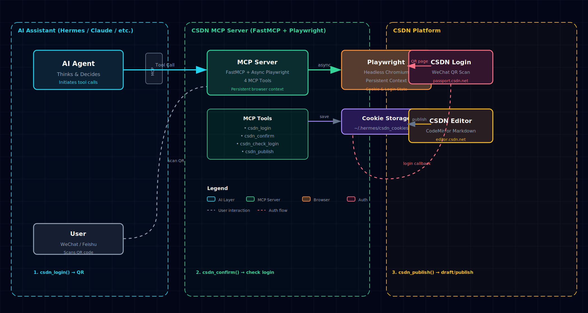

## 动机

最近在用 Hermes 帮我写博客。流程是 AI 生成 Markdown → 我手动复制到 CSDN 编辑器 → 调格式 → 发布。每次都要切浏览器、扫码登录、粘贴、调分类标签，烦得很。

有没有可能让 AI 直接发到 CSDN？

查了一圈，CSDN 没有公开 API。市面上有个 `blog-auto-publishing-tools`，但两年没更新了。而且它依赖连接你本地已登录的 Chrome 浏览器——在 WSL 里根本连不上 Windows 的 Chrome。

那就自己写一个 MCP (Model Context Protocol) Server 吧。

## 架构设计

核心思路：**Playwright 浏览器常驻在 MCP 进程里**，一次扫码登录后所有操作共享同一个浏览器上下文，登录态不会丢失。



整个流程分三步：

1. **`csdn_login`**：打开 CSDN 登录页，截取微信扫码二维码发给用户
2. **`csdn_confirm`**：检测用户扫码后页面是否跳转，确认登录成功
3. **`csdn_publish`**：打开 CSDN 编辑器，注入 Markdown 内容，默认存草稿（发布需用户确认）

## 踩坑记录

这个项目看着简单，实际踩了不少坑。

### 坑一：线程安全

最初用的是 Playwright 的同步 API（`sync_playwright`），一跑就崩：

```
cannot switch to a different thread (which happens to have exited)
```

原因：FastMCP 可能在**不同线程调度 tool 调用**，而 Playwright 的同步 API 要求所有操作在同一个线程。每次 tool 调用都创建新 page，上一个 page 属于不同线程——Playwright 直接炸。

解决：全部改用 **async Playwright + asyncio**。异步 API 天生在 event loop 单线程运行，不会有跨线程问题。

### 坑二：扫码回调丢失

第一版设计是这样的：

```
csdn_login → 打开二维码页 → 截屏 → 关闭页面
csdn_confirm → 打开新页面 → 跳编辑器 → 检测登录态
```

结果 `csdn_confirm` 永远检测不到登录。因为**微信扫码的回调发生在原始页面上**，你把原始页面关了，新开的页面拿不到 callback。

修了 v4 版本：**二维码页面保持存活**，`csdn_confirm` 直接检查这个页面的 URL 有没有跳转离开登录页。跳转了 = 扫码成功。

### 坑三：草稿保存不触发

CSDN 编辑器用 CodeMirror，内容我通过 `CodeMirror.setValue()` 注入——但这不触发编辑器的「修改事件」。CSDN 自动保存监听的是真实的 `input` 事件，编程式注入的内容被当空气。

修了两个 trick：
1. 注入后用 `dispatchEvent(new Event('input'))` 模拟输入事件
2. 再用 `page.keyboard.type(" ")` + `Backspace` 来一次真实的键盘输入

两个叠加才真正唤醒了 CSDN 的自动保存机制。

### 坑四：「取消」按钮踩雷

有一版设计为了加标签，先打开发布弹窗，加完标签再点「取消」退回编辑器——结果连编辑内容一起取消了。后来干脆**草稿模式不碰发布弹窗**，纯靠自动保存。

## 最终效果

现在 AI 帮我写完博客后，对话里直接说「发到 CSDN 草稿箱」，一秒钟就上去了，全程不用切浏览器。

流程对比如下：

| 步骤 | 手动发布 | MCP 自动 |
|------|---------|----------|
| 登录 CSDN | 打开浏览器，扫码 | AI 自动生成二维码 |
| 进入编辑器 | 点「写文章」 | AI 自动导航 |
| 粘贴内容 | Ctrl+V | AI 注入 CodeMirror |
| 保存草稿 | 等自动保存 | AI 触发保存事件 |
| 发布 | 填标签 → 点发布 | AI 填标签 → 需确认后发布 |

目前 CSDN MCP Server 已经开源在 GitHub：**https://github.com/luolaihua/csdn-mcp**（等 push 后可用）

配合微信公众平台的文颜 MCP，还能实现「一文多发」——写完自动同步到 CSDN 和公众号，对于有双平台发布需求的博主来说简直爽翻。

## 后续计划

- [ ] Cookie 持久化到文件，进程重启后恢复登录态（不用重新扫码）
- [ ] 支持封面图上传
- [ ] 支持分类专栏选择
- [ ] 发布后自动返回文章 URL

欢迎 Star / PR。

## 参考链接

- [MCP 协议规范](https://modelcontextprotocol.io/)
- [FastMCP 文档](https://gofastmcp.com/)
- [Playwright Python](https://playwright.dev/python/)
- [Wenyan MCP — 微信公众号发布](https://github.com/caol64/wenyan-mcp)
