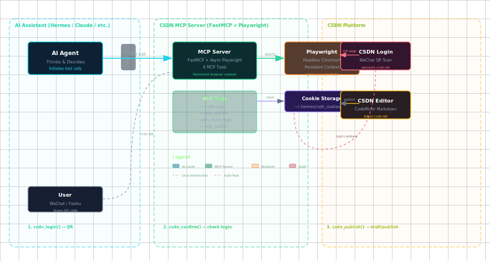

写作不是最花时间的，发布才是。

我写技术文章的习惯：让 AI 帮我写完 → 手动复制到 CSDN → 调格式 → 找个图床传图 → 再复制到公众号编辑器 → 再调一遍格式。

一篇文章写 20 分钟，发出去要半小时。

CSDN 没公开 API。公众号倒是有，但排版是出了名的反人类。网上的工具要么两年没更新，要么依赖你本地登录的 Chrome 浏览器，换台机器就得重配。

所以我自己搞了两套 MCP Server，把「发布」这个事做成了 AI 一句话的事。

---

## 两套方案

### CSDN：用浏览器冒充人工

CSDN 没 API，那就模拟人操作。Playwright 开一个 headless 浏览器常驻在 MCP 进程里：

扫码登录 → 打开编辑器 → 注入 Markdown → 触发保存 → 发布。

一次扫码后登录态写进 cookie 文件，后面不用再扫。

### 公众号：走正经 API

文颜（Wenyan）是现成的 MCP Server，对接微信公众平台的素材和草稿箱接口。

你给 Markdown + 图片路径，格式转换 → 图片上传 → 主题渲染 → 推送草稿箱，一步到位。内置 8 套主题，不用自己写 CSS。

### 架构图



左边是 AI 助手，中间是 MCP Server，右边是对应的平台。你在对话里说一句话，剩下的全自动。

---

## 公众号：上手 5 分钟

第一步，拿凭证。去微信公众号后台 → 设置与开发 → 基本配置，复制 AppID 和 AppSecret。同一页面加 IP 白名单：

```bash
curl ifconfig.me  # 看你家机器的出口 IP
```

第二步，装工具：

```bash
npm install -g @wenyan-md/mcp
```

第三步，配到 Hermes 的 config.yaml 里，重启 gateway，对话说「列出主题」验证连通性。

第四步，写文章时带上 frontmatter：

```markdown
---
title: "标题"
cover: /path/to/cover.png
author: 你的名字
---
```

然后跟 Hermes 说：「发到公众号草稿箱，orangeheart 主题」。30 秒后草稿箱里就有了。

---

## CSDN：首次要扫码

CSDN 这边需要多一步：装 Playwright 的浏览器：

```bash
pip install playwright
playwright install chromium-headless-shell
```

把 CSDN MCP 加到 config.yaml，对话里说 `csdn_login`，弹出一个二维码，微信扫一下。之后 Cookie 持久化，不用再扫了。

默认存草稿，确认后才发布。发布后自动返回文章链接。

---

## 双平台一起发

两个 MCP 跑在同一个 Hermes 里，一个助手管两边。我现在的流程：

1. AI 写完 → 我快速过一遍
2. 「发到公众号」→ 30 秒草稿箱到位
3. 「发到 CSDN」→ 进草稿箱，看一眼没问题再确认发布

从搞定内容到两边都发好，5 分钟。

---

## 踩过的坑

**二维码页面不能关。** 微信扫码回调发生在原始页面上，你把页面关了，回调丢了，永远检测不到登录。这个问题修了好几版才发现。

**CodeMirror.setValue() 不触发保存。** CSDN 编辑器监听的是真实 input 事件，编程式写进去的内容它当没发生。得 dispatchEvent + 模拟一次键盘输入，两个一起上才能唤醒自动保存。

**IP 会变。** 公众号的 IP 白名单是硬绑定。家庭宽带或者 VPN 一换，IP 就变了，报 40164 就去后台更新一下。

**运营商的网络一言难尽。** Playwright 下 CSDN 页面时要等所有资源加载完，但百度统计那些第三方资源经常超时。解决方案：只用 `domcontentloaded`，不等网络空闲。

---

## 代码审查：AI 写的代码，AI 来审

迭代到 v20 的时候，我让 Claude Code 对 CSDN MCP 做了一次完整的代码审查。结果被找出好几个挺尴尬的问题：

**保存按钮点了两次。** 草稿保存的路径里，if 分支点了一次保存，循环外面又无条件点了一次。双击了。如果 CSDN 的保存请求是幂等的还好，不幂等就出大问题。

**检查登录状态的函数从不检查实际的浏览器登录态。** `csdn_check_login` 返回的是进程启动时初始化的布尔值（永远是 False），没去调 `_ensure_browser()` 加载 cookie 并实际访问编辑器验证。相当于你问「到站了吗」，它看都没看路就说「没到」。

**`selectAll` + `insertText('')` 随时可能清空整个编辑器。** 图片上传后的清理阶段执行的这段代码，如果注入正文的时机晚了一步，用户所有内容都会被清掉。虽然概率低，但一旦触发就是事故。

**几乎所有 `except:` 都在静默吞异常。** 九个捕获点全用 `pass` —— 代码出错了没人知道，排查只能靠猜。

改起来不复杂：双击去掉多余的 click；`check_login` 改 async，走一遍完整的浏览器检测流程；干掉那段危险的清理代码；所有 `except` 至少加个 `print('[WARN] ...')`。顺便把几处 `asyncio.sleep(N)` 换成 Playwright 的 `wait_for_selector()`——更快，也更可靠。

修复后跑了测试，3 张图片全部上传成功，文章正常保存到草稿箱。这次教训是：AI 写的自动化代码，用另一个 AI 来审查，能补上很多盲区。

---

## 公众号主题一览

文颜内置 8 套主题，覆盖不同风格：

| 主题 | 风格 | 适合 |
|------|------|------|
| Default | 简洁 | 长文 |
| OrangeHeart | 暖橙 | 技术文（我常用） |
| Rainbow | 多彩 | 轻松内容 |
| Lapis | 蓝灰 | 产品设计 |
| Pie | 现代 | 少数派风格 |
| Maize | 淡黄 | 教程科普 |
| Purple | 紫色 | 品牌调性 |
| Phycat | 薄荷绿 | 结构化长文 |

---

## 最后说两句

两套方案覆盖了我 90% 的发文场景：

- 公众号有正经 API，一次配置，之后跟说话一样简单
- CSDN 没 API，但浏览器自动化把「模拟人操作」这件事做到能用了
- 两个 MCP 跑一起，一个 AI 助手发两边

工具的意义不是炫技——是真省时间。一篇文章发布只要 30 秒，你自然会更愿意写。
